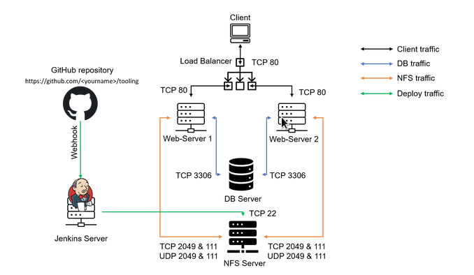
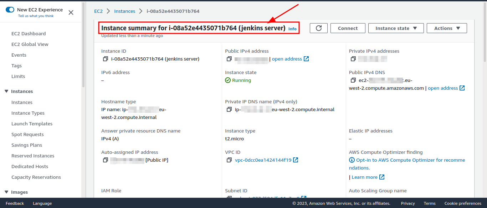
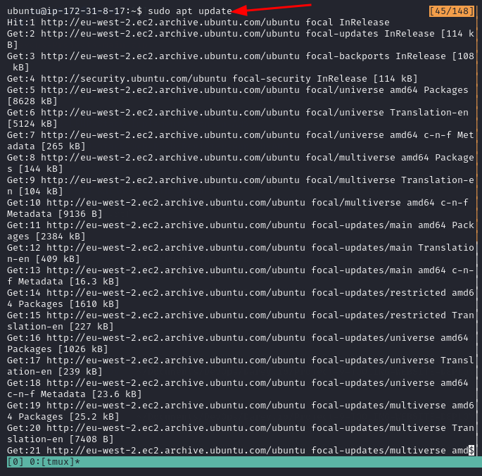
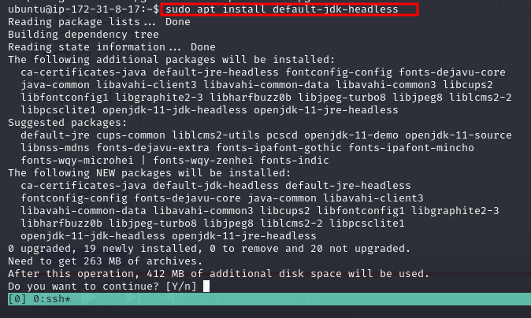

# TOOLING-WEBSITE-DEPLOYMENT-AUTOMATION-WITH-CONTINUOUS-INTEGRATION-USING-JENKINS
In this project, we are going to start automating part of our routine tasks with a free and open-source automation server – Jenkins. It is one of the most popular CI/CD tools.
According to Circle CI, Continuous integration (CI) is a software development strategy that increases the speed of development while ensuring the quality of the code that teams deploy. Developers continually commit code in small increments (at least daily, or even several times a day), which is then automatically built and tested before it is merged with the shared repository.
In our project we are going to utilize Jenkins CI capabilities to make sure that every change made to the source code in GitHub `https://github.com/<yourname>/tooling` will be automatically updated to the Tooling Website.

---------
__________

## Task
Enhance the architecture prepared in [the last project](https://github.com/lateef-taiwo/LOAD-BALANCER-SOLUTION-WITH-APACHE) by adding a Jenkins server, and configuring a job to automatically deploy source code changes from Git to the NFS server.

## Architecture Diagram
Here is what your updated architecture will look like upon completion of this project:

----------
__________

### INSTALL AND CONFIGURE JENKINS SERVER
### Step 1 – Install the Jenkins server
* Create an AWS EC2 server based on Ubuntu Server 20.04 LTS and name it "Jenkins server"

  

* Install JDK (since Jenkins is a Java-based application)

  `sudo apt update`
   
   

   `sudo apt install default-jdk-headless`

   

* Install Jenkins
  
        wget -q -O - https://pkg.jenkins.io/debian-stable/jenkins.io.key | sudo apt-key add -
        sudo sh -c 'echo deb https://pkg.jenkins.io/debian-stable binary/ > \
            /etc/apt/sources.list.d/jenkins.list'
        sudo apt update
        sudo apt-get install jenkins

* check if Jenkins is up and running. `sudo systemctl status jenkins`